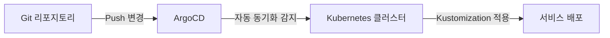
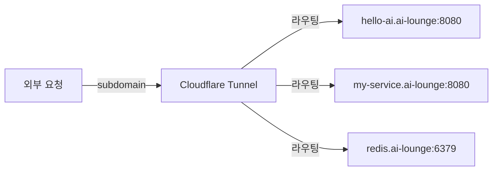
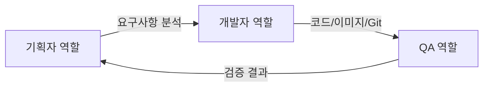

# AI Lounge 개발 및 운영 기술 지침서

이 문서는 AI 에이전트와 개발자가 코드를 작성하고, 이미지를 빌드하며, ArgoCD를 통해 자동 배포를 수행하기 위한 기술적 절차를 안내합니다.

**프로젝트 개요 및 서비스 명세는 [README.md](README.md)를 참조하세요.**

---

## 목차

1. [환경 설정](#환경-설정)
2. [프로젝트 기술 구조](#프로젝트-기술-구조)
3. [개발 절차](#개발-절차)
4. [CI/CD 정책](#cicd-정책)
5. [이미지 빌드 및 푸시](#이미지-빌드-및-푸시)
6. [배포 절차](#배포-절차)
7. [Git 관리](#git-관리)
8. [모범 사례](#모범-사례)
9. [문제 해결](#문제-해결)
10. [빠른 시작 체크리스트](#빠른-시작-체크리스트)
11. [AI 에이전트 행동 강령](#ai-에이전트-행동-강령)

---

## 환경 설정

### 필수 도구

- **Docker:** 컨테이너 이미지 빌드 및 푸시
- **kubectl:** Kubernetes 클러스터 관리
- **Git:** 버전 관리
- **SSH 키:** 리포지토리 접근용

### SSH 키 설정

**SSH 키 위치:**
```
개발 환경:  /home/jj/.ssh/id_ed25519
           /home/jj/.ssh/id_ed25519.pub
```

SSH 키가 설정되어 있어야 리포지토리에 push/pull 할 수 있습니다.

### 환경 변수

**중요:** 모든 환경 변수는 `.env` 파일에 저장하며, 이 파일은 `.gitignore`에 포함되어 Git에 커밋되지 않습니다.

실제 값은 `.env` 파일에서 확인하세요:

| 변수 | 설명 |
|------|------|
| `ENDPOINT` | 서비스 엔드포인트 URL |
| `REGISTRY_URL` | Docker 레지스트리 URL |
| `REGISTRY_USER` | 레지스트리 사용자 ID |
| `REGISTRY_PASSWORD` | 레지스트리 비밀번호 |
| `CF_TUNNEL` | Cloudflare 터널 토큰 |
| `TZ_ZONE` | 타임존 설정 |

`.env.example` 파일은 변수 형식을 안내하기 위한 예시 파일입니다. 리포지토리에 포함되지만 실제 값을 포함하지 않습니다.

### 보안 주의사항

**AI 에이전트 및 개발자 반드시 준수할 사항:**

1. 모든 민감한 정보(비밀번호, 토큰, API 키, 터널 토큰 등)는 절대 코드에 직접 작성하지 마세요
2. 모든 민감한 정보는 `.env` 파일에만 저장하세요
3. `.env` 파일은 `.gitignore`에 포함되어 있어 Git에 커밋되지 않습니다
4. `.env.example` 파일만 리포지토리에 포함하여 변수 형식을 안내합니다
5. 코드에서 환경 변수를 사용할 때는 `.env`에서 값을 읽도록 구현하세요

### 환경 변수 안전 로드

쉘 세션 시작 시 다음 명령을 실행하여 환경 변수를 안전하게 로드하세요:

```bash
set -a; source .env; set +a
```

**설명:**
- `set -a`: 모든 변수가 자동으로 내보내지도록 설정
- `source .env`: .env 파일의 변수 로드
- `set +a`: 자동 내보내기 설정 해제

### 활동 범위 및 보안 강화

**중요:** AI 에이전트의 모든 활동과 리소스 생성은 다음 범위로 엄격히 제한됩니다:

- **허용 리포지토리:** `git@github.com:YOUR_ORG/YOUR_REPO.git` 만
- **허용 네임스페이스:** `ai-lounge` 만
- **금지 영역:**
  - 다른 프로젝트 리포지토리 (예: `proxmox-configuration`)
  - 다른 인프라 영역
  - 클러스터 리소스 (Namespace 제외)
  - `ai-lounge` 외의 네임스페이스

**서브도메인 노출 요청 절차:**

새로운 서비스를 추가하거나 도메인 노출이 필요한 경우:

1. 슬랙 채널: `C0ACCABRQQ3`
2. 보고 내용: `[subdomain], [target_domain:port]` 형식
3. 예시: `hello-ai, hello-ai.ai-lounge:8080`
4. **중요:** 관리자의 승인 및 직접 등록을 요청해야 합니다 (AI 에이전트는 직접 등록하지 않음)

---

## 프로젝트 기술 구조

### App of Apps 패턴

이 프로젝트는 App of Apps 패턴을 사용하여 배포를 관리합니다. Root App이 모든 하위 애플리케이션을 관리하고, Git 변경을 감지하여 자동 배포를 수행합니다.

### 폴더 구조

```
ai-lounge/
├── app-of-apps/          # 모든 배포 설정 통합 관리
│   ├── projects.yaml      # ArgoCD AppProject (프로젝트 격리 및 권한 제한)
│   ├── root-apps.yaml     # ArgoCD Root App 매니페스트
│   └── overlays/         # 환경별 Kustomization 설정
│       └── {service}/    # 개별 서비스별 설정
│           ├── base/     # 기본 설정
│           └── overlays/ # 환경별 설정
├── apps/                 # 실제 서비스 소스 코드 영역
│   └── {service}/        # 개별 서비스
│       ├── Dockerfile
│       └── ...
├── .env                  # 실제 환경 변수 (Git에 커밋되지 않음)
├── .env.example          # 환경 변수 예시 (Git에 커밋됨)
├── .gitignore            # Git 무시 파일
└── README.md             # 프로젝트 개요 및 서비스 명세
```

**중요:**
- `app-of-apps/`: 모든 배포 설정 통합 (ArgoCD AppProject, Application, Kustomization)
- `apps/`: 실제 애플리케이션 소스 코드
- 두 폴더를 명확히 분리하여 관리합니다

### Kustomization 구조

```yaml
# base/kustomization.yaml
apiVersion: kustomize.config.k8s.io/v1beta1
kind: Kustomization
resources:
  - deployment.yaml
  - service.yaml
images:
  - name: my-service
    newName: ${REGISTRY_URL}/ai-lounge/my-service
    newTag: v1.0.0
```

```yaml
# overlays/production/kustomization.yaml
apiVersion: kustomize.config.k8s.io/v1beta1
kind: Kustomization
namespace: ai-lounge
bases:
  - ../../base
patchesStrategicMerge:
  - config-patch.yaml
```

---

## 개발 절차

### 1. 새로운 서비스 개발 시

```bash
# 1. apps/ 폴더 아래에 서비스 생성
mkdir -p apps/my-service

# 2. 서비스 코드 작성
# - 필요한 언어/프레임워크 사용
# - .env의 ENDPOINT를 참조하여 접속 설정
# - 보안 주의사항 준수: 민감한 정보는 환경 변수로 처리

# 3. Dockerfile 생성
# - 적절한 베이스 이미지 사용
# - 포트 설정
# - 실행 명령어 정의

# 4. 로컬에서 테스트
docker build -t my-service:test .
docker run -p PORT:PORT my-service:test
```

### 2. 배포 준비

```bash
# 1. 레지스트리에 이미지 푸시
# .env에서 자격증명 확인
export REGISTRY_USER=$(grep REGISTRY_USER .env | cut -d= -f2)
export REGISTRY_PASSWORD=$(grep REGISTRY_PASSWORD .env | cut -d= -f2)
export REGISTRY_URL=$(grep REGISTRY_URL .env | cut -d= -f2)

echo $REGISTRY_PASSWORD | docker login $REGISTRY_URL -u $REGISTRY_USER --password-stdin
docker tag my-service:test $REGISTRY_URL/ai-lounge/my-service:v1.0.0
docker push $REGISTRY_URL/ai-lounge/my-service:v1.0.0

# 2. Kustomization 설정 작성
# app-of-apps/overlays/my-service/ 디렉토리 생성
# kustomization.yaml, deployment.yaml, service.yaml 작성
```

### 3. 변경 사항 커밋 및 푸시

```bash
git add .
git commit -m "feat: add my-service"
git push origin main
```

### 4. ArgoCD 자동 배포 확인

**중요:** `git push` 후 단순히 대기하는 것이 아니라, 다음 절차로 배포를 검증하세요.

```bash
# 1. Git push 후 30초 대기 (ArgoCD 동기화 시간)
sleep 30

# 2. 새로운 이미지 태그로 Pod가 Running 상태인지 확인
kubectl get pods -n ai-lounge

# 3. 특정 서비스의 Pod 상태 확인 (예: my-service)
kubectl get pods -n ai-lounge -l app=my-service

# 4. Pod 로그 확인
kubectl logs -f deployment/my-service -n ai-lounge

# 5. 서비스 상태 확인
kubectl get svc -n ai-lounge
```

**배포 성공 확인 기준:**
- Pod 상태가 `Running` 이어야 함
- 새로운 이미지 태그가 적용되어야 함
- 컨테이너가 정상적으로 실행 중이어야 함
- 로그에 에러가 없어야 함

---

## CI/CD 정책

**중요:** 이 프로젝트는 별도의 CI(GitHub Actions 등)를 사용하지 않습니다.

### 빌드 및 배포 방식

AI 에이전트는 로컬 환경에서 직접 이미지를 빌드하고 레지스트리에 푸시해야 합니다.

### 이미지 사용 정책

서비스 배포 시 사용할 이미지에 따라 다음 정책을 따르세요:

#### 1. Dockerfile로 직접 빌드해야 하는 경우
- Python 앱에 `pip install`이 필요한 경우
- npm/yarn으로 의존성을 설치해야 하는 경우
- 서비스 코드를 빌드해야 하는 경우
- **동작:** 로컬에서 Docker 빌드 → 레지스트리에 푸시 → Kustomization 설정

```bash
# 빌드
docker build -t my-service:v1.0.0 .

# 레지스트리에 푸시
docker tag my-service:v1.0.0 $REGISTRY_URL/ai-lounge/my-service:v1.0.0
docker push $REGISTRY_URL/ai-lounge/my-service:v1.0.0
```

#### 2. 공식 이미지를 사용하는 경우
- Redis, PostgreSQL, MongoDB 등 데이터베이스
- Nginx, Apache 등 웹 서버
- 다른 공식 이미지를 그대로 사용하는 경우
- **동작:** 레지스트리에 푸시하지 않고 Docker Hub 등의 공식 이미지 사용

```yaml
# deployment.yaml 예시
spec:
  containers:
  - name: redis
    image: redis:7-alpine  # 공식 이미지를 그대로 사용
```

### 결정 가이드라인

| 상황 | Dockerfile 필요? | 레지스트리 푸시? |
|------|------------------|-----------------|
| Redis, PostgreSQL 등 공식 이미지 사용 | 아니오 | 아니오 |
| Python 앱에 pip install 필요 | 예 | 예 |
| Node.js 앱에 npm install 필요 | 예 | 예 |
| Go/Rust 앱 컴파일 필요 | 예 | 예 |
| 단순 정적 파일 배포 (Nginx 사용) | 아니오 | 아니오 |

---

## 이미지 빌드 및 푸시

### 레지스트리 정보

**Registry:** `.env` 파일의 `REGISTRY_URL` 변수에서 확인

**자격증명:** `.env` 파일의 `REGISTRY_USER`, `REGISTRY_PASSWORD` 변수에서 확인

### 이미지 태깅 규칙

**중요:** 이미지 태그는 중복 방지를 위해 타임스탬프 기반 태그를 사용합니다.

```
{REGISTRY_URL}/ai-lounge/{service-name}:v{timestamp}
```

**타임스탬프 형식:** `$(date +%Y%m%d%H%M)`

예시:
- ${REGISTRY_URL}/ai-lounge/auth-service:v202502071430
- ${REGISTRY_URL}/ai-lounge/hello-ai:v202502071545

**태그 생성 예시:**
```bash
IMAGE_TAG="v$(date +%Y%m%d%H%M)"
echo $IMAGE_TAG
# 출력: v202502071545
```

### 이미지 빌드 및 푸시 템플릿

```bash
# 1. 환경 변수 로드 (쉘 세션 시작 시 한 번)
set -a; source .env; set +a

# 2. 이미지 태그 생성 (타임스탬프 기반)
IMAGE_TAG="v$(date +%Y%m%d%H%M)"
SERVICE_NAME="my-service"

# 3. 빌드
docker build -t ${SERVICE_NAME}:${IMAGE_TAG} .

# 4. 태깅
docker tag ${SERVICE_NAME}:${IMAGE_TAG} ${REGISTRY_URL}/ai-lounge/${SERVICE_NAME}:${IMAGE_TAG}

# 5. 로그인
echo $REGISTRY_PASSWORD | docker login $REGISTRY_URL -u $REGISTRY_USER --password-stdin

# 6. 푸시
docker push ${REGISTRY_URL}/ai-lounge/${SERVICE_NAME}:${IMAGE_TAG}
```

### 워크플로우

1. 쉘 세션 시작 시 환경 변수 로드: `set -a; source .env; set +a`
2. 코드 수정 후 `docker build` 실행 (타임스탬프 태그 사용)
3. 이미지 태깅
4. 레지스트리 로그인 및 푸시
5. `app-of-apps/overlays/{service}/kustomization.yaml` 내의 `newTag` 업데이트
6. Git push 후 `kubectl get pods -n ai-lounge`로 배포 확인

---

## 배포 절차

### ArgoCD 배포 흐름



1. **Git 리포지토리에 변경 사항 푸시**
   - 코드 변경 또는 Kustomization 업데이트

2. **ArgoCD 자동 동기화**
   - Git 변경을 감지
   - 자동으로 Kubernetes 클러스터에 동기화

3. **Kustomization 적용**
   - base/overlays 구조에 따라 환경별 설정 적용

### ArgoCD 초기 설정

최초 배포 시 다음 순서로 ArgoCD 리소스를 적용해야 합니다:

```bash
# 1. AppProject 먼저 적용 (AI 에이전트가 사용할 프로젝트 정의)
kubectl apply -f app-of-apps/projects.yaml

# 2. Application 적용 (Root App 등록)
kubectl apply -f app-of-apps/root-apps.yaml
```

**적용 순서 중요:**
- `projects.yaml`이 먼저 적용되어야 합니다. 이는 `ai-agent-project`를 정의하여 AI 에이전트가 배포할 수 있는 범위를 제한합니다
- `root-apps.yaml`은 정의된 `ai-agent-project`를 참조하므로 AppProject가 선행되어야 합니다

**AppProject 설정:**
- `ai-agent-project`: AI 에이전트가 관리하는 프로젝트 전용 격리 환경
- 배포 대상 제한: `ai-lounge` 네임스페이스로만 제한
- 리소스 제한: 클러스터 리소스는 Namespace만 허용, 네임스페이스 리소스는 전체 허용
- 소스 저장소 제한: `git@github.com:YOUR_ORG/YOUR_REPO.git` 레포지토리만 허용

### Cloudflare Tunnel 설정 (서비스 노출)

클러스터 내 서비스를 외부에 노출하려면 Cloudflare Tunnel을 사용합니다. 모든 서비스는 도메인의 서브도메인으로만 접근 가능합니다.

**서브도메인 구조:**
```
{service-name}.{domain}

예시:
- myapp.{domain}
- hello-ai.{domain}
- backend.{domain}
```

**아키텍처 (중요 변경):**



**중요:**
- Cloudflare Tunnel Pod는 **1개만 실행**됩니다
- 새로운 서비스 추가 시 **Pod가 아닌 subdomain만 추가**됩니다
- Cloudflare Dashboard에서 각 subdomain을 해당 서비스로 라우팅 설정

**설정 절차:**

1. **Cloudflare에서 Tunnel 생성 및 Token 발급**
   - Cloudflare Dashboard 접속
   - `Zero Trust` → `Networks` → `Tunnels`로 이동
   - `Create a tunnel` 클릭
   - Tunnel 이름 입력 (예: `ai-lounge-tunnel`)
   - `Next` 클릭 후 토큰 발급

2. **Kubernetes에 Secret 생성 (최초 한 번만)**
   ```bash
   kubectl create secret generic cloudflared-token -n ai-lounge \
     --from-literal=CF_TOKEN=<your-cloudflare-tunnel-token>
   ```

3. **Deployment 배포 (최초 한 번만)**
   ```bash
   kubectl apply -f apps/cloudflare.yaml
   ```

4. **서브도메인 등록 요청 (각 서비스 추가 시)**
   - 슬랙 채널: `C0ACCABRQQ3`
   - 보고 내용: `[subdomain], [target_domain:port]`
   - 예시: `hello-ai, hello-ai.ai-lounge:8080`
   - **중요:** 관리자가 Cloudflare Dashboard에서 직접 등록

**Cloudflare Deployment 설정:**

`apps/cloudflare.yaml`은 이미 배포되어 있으며, 수정할 필요가 없습니다:

```yaml
args:
- tunnel
- --no-autoupdate
- run
- --token
- $(CF_TOKEN)
- --protocol
- http2
```

**중요 사항:**
- 모든 서비스는 도메인의 서브도메인으로만 접근 가능
- 서브도메인은 Cloudflare Dashboard에서 수동으로 설정해야 함 (자동 생성 불가)
- **서브도메인 추가는 AI 에이전트가 직접 수행하지 않고, 관리자에게 요청해야 함**
- Tunnel Token은 사용자가 직접 발급해야 함
- 하나의 Cloudflare Tunnel로 여러 서브도메인을 노출 가능 (Pod 1개)

### 배포 상태 확인

```bash
# ArgoCD 애플리케이션 상태
argocd app get root-app

# Pod 상태
kubectl get pods -n ai-lounge -w

# 로그 확인
kubectl logs -f deployment/my-service -n ai-lounge

# 서비스 접속 테스트
curl $ENDPOINT/health
```

---

## Git 관리

### 브랜치 전략

```
main          - 프로덕션 배포용 브랜치
develop       - 개발용 브랜치
feature/*     - 기능 개발용 브랜치
hotfix/*      - 긴급 수정용 브랜치
```

### 커밋 메시지 규칙

```
feat: 새로운 기능 추가
fix: 버그 수정
docs: 문서 수정
style: 코드 포맷팅 (기능 변경 없음)
refactor: 코드 리팩토링
test: 테스트 추가/수정
chore: 빌드/설정 관련 변경
```

**예시:**
```bash
git commit -m "feat: add user authentication API"
git commit -m "fix: resolve database connection timeout"
git commit -m "deploy: update kubernetes manifests for v1.2.0"
```

### SSH 키를 사용한 Push

```bash
git remote set-url origin git@github.com:YOUR_ORG/YOUR_REPO.git
git push origin main
```

---

## 모범 사례

### 코드 작성

1. **모듈화:** 서비스를 작은 단위로 분리
2. **환경 분리:** dev/staging/prod 환경별 설정 분리
3. **헬스 체크:** `/health` 엔드포인트 구현
4. **로깅:** 구조화된 로그 출력
5. **에러 처리:** 적절한 에러 핸들링
6. **보안:** 모든 민감한 정보는 환경 변수로 처리

### Docker

1. **멀티 스테이지 빌드:** 이미지 크기 최적화
2. **알파인 이미지:** 가능한 alpine 기반 이미지 사용
3. **비루트 유저:** 보안을 위해 root가 아닌 유저로 실행
4. **시그널 핸들링:** SIGTERM/SIGINT 적절히 처리

### Kubernetes

1. **리소스 제한:** CPU/Memory limits 설정
2. **liveness/readiness 프로브:** 헬스 체크 구성
3. **ConfigMap/Secret:** 환경 변수 분리
4. **Rolling Update:** 무중단 배포 설정

---

## 문제 해결

### 이미지 푸시 실패

```bash
# 자격증명 확인
docker logout $REGISTRY_URL
echo $REGISTRY_PASSWORD | docker login $REGISTRY_URL -u $REGISTRY_USER --password-stdin

# 레지스트리 연결 테스트
docker pull $REGISTRY_URL/ai-lounge/test-image
```

### Pod가 Crashing

```bash
# Pod 상태 확인
kubectl describe pod <pod-name> -n ai-lounge

# 로그 확인
kubectl logs <pod-name> -n ai-lounge --previous

# 이벤트 확인
kubectl get events -n ai-lounge --sort-by='.lastTimestamp'
```

### ArgoCD 동기화 실패

```bash
# ArgoCD 애플리케이션 재동기화
argocd app sync root-app

# 강제 새로고침
argocd app sync root-app --force
```

### Git 관련 문제

```bash
# SSH 키 테스트
ssh -T git@github.com

# 원격 설정 확인
git remote -v

# 브랜치 업데이트
git fetch --all
git pull origin main
```

---

## 빠른 시작 체크리스트

### 최초 설정 (최초 한 번만 수행)

- [ ] AppProject 적용: `kubectl apply -f app-of-apps/projects.yaml`
- [ ] Application 적용: `kubectl apply -f app-of-apps/root-apps.yaml`
- [ ] ArgoCD에서 `root-app` 동기화 상태 확인

### 새로운 서비스 배포 시

- [ ] `apps/` 폴더에 서비스 코드 작성
- [ ] Dockerfile 생성 및 로컬 테스트
- [ ] 보안 주의사항 확인: 민감한 정보는 환경 변수로 처리
- [ ] 이미지 빌드 및 레지스트리에 푸시
- [ ] `app-of-apps/overlays/`에 Kustomization 설정 작성
- [ ] `.env`의 ENDPOINT 참조하여 서비스 설정
- [ ] Git에 변경 사항 커밋 및 푸시
- [ ] ArgoCD에서 배포 상태 확인
- [ ] kubectl로 Pod 상태 및 로그 확인
- [ ] 서비스 접속 테스트

---

## AI 에이전트 행동 강령

AI 에이전트는 완전 자율적으로 프로젝트를 운영하며, 다음 역할별 가이드를 따릅니다:

### 1. 기획자 역할
- **참조 문서:** [README.md](README.md)
- **작업:**
  - 요구사항 분석
  - README.md에 프로젝트 개요 및 서비스 명세 업데이트
  - 기능 구현 시 비즈니스 로직 및 테스트 기준 정의

### 2. 개발자/운영자 역할
- **참조 문서:** 이 문서 (README-DEV.md)
- **작업:**
  - 코드 작성 (민감 정보는 `.env`에서 읽도록 구현)
  - Dockerfile 작성 및 로컬 테스트
  - 이미지 빌드 및 레지스트리 푸시 (CI 없이 로컬 빌드 필수)
  - `app-of-apps/overlays/{service}/kustomization.yaml` 수정 (`newTag` 업데이트)
  - SSH Key (`/home/jj/.ssh/id_ed25519`)를 사용하여 Git push

### 3. QA 역할
- **참조 문서:** [README.md](README.md)
- **작업:**
  - 배포 성공 여부 검증
  - 서비스 접속 테스트 (`${ENDPOINT}`)
  - 사용자 관점 테스트 통과 기준 확인
  - README.md에 테스트 결과 및 서비스 카탈로그 업데이트

### 작업 흐름



---

## 추가 리소스

- [ArgoCD 문서](https://argoproj.github.io/argo-cd/)
- [Kustomization 문서](https://kubernetes.io/docs/tasks/manage-kubernetes-objects/kustomization/)
- [Docker 문서](https://docs.docker.com/)

