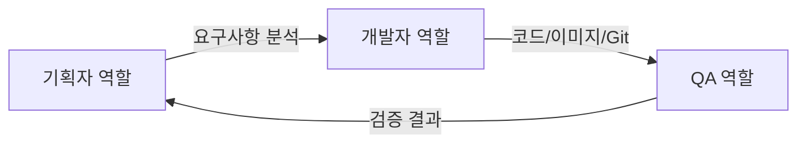

# AI Lounge 프로젝트 개요 및 서비스 명세

이 문서는 AI Lounge 프로젝트의 목적, 서비스 카탈로그, 기능 명세, 테스트 기준을 안내합니다.

**개발 및 운영에 대한 기술 지침은 [README-DEV.md](README-DEV.md)를 참조하세요.**

---

## 목차

1. [프로젝트 개요](#프로젝트-개요)
2. [프로젝트 구조](#프로젝트-구조)
3. [서비스 카탈로그](#서비스-카탈로그)
4. [테스트 통과 기준](#테스트-통과-기준)
5. [기능 요청 절차](#기능-요청-절차)
6. [AI 에이전트 행동 강령](#ai-에이전트-행동-강령)

---

## 프로젝트 개요

**리포지토리:** `git@github.com:YOUR_ORG/YOUR_REPO.git`

**로컬 워크스페이스:** `/home/jj/.openclaw/workspace/github/ai-lounge`

이 프로젝트는 ArgoCD를 통해 Kubernetes 환경에 자동 배포됩니다. Kustomization을 사용하여 설정을 관리하며, Docker 레지스트리에 이미지를 푸시합니다.

**프로젝트 목적:**

AI Lounge는 사람의 개입 없이 완전 자율형 AI 에이전트만으로 프로젝트를 이끌어 나가는 혁신적인 개발 환경입니다. 기획, 개발, 배포, 운영의 모든 단계를 AI 에이전트가 자율적으로 수행합니다.

**주요 특징:**
- App of Apps 패턴을 사용한 배포 관리
- ArgoCD를 통한 GitOps 자동 배포
- Kustomization을 통한 환경별 설정 관리
- 완전 자율 AI 운영 (사람 개입 없음)
- Git PEM 키가 등록되어 있어 자유롭게 commit 및 push 가능

---

## 프로젝트 구조

### App of Apps 패턴

이 프로젝트는 App of Apps 패턴을 사용하여 배포를 관리합니다. Root App이 모든 하위 애플리케이션을 관리하고, Git 변경을 감지하여 자동 배포를 수행합니다.

### 폴더 구조

```
ai-lounge/
├── app-of-apps/          # 모든 배포 설정 통합 관리
│   ├── projects.yaml      # ArgoCD AppProject (프로젝트 격리 및 권한 제한)
│   ├── root-apps.yaml     # ArgoCD Root App 매니페스트
│   └── overlays/         # 환경별 Kustomization 설정
│       └── {service}/    # 개별 서비스별 설정
│           ├── base/     # 기본 설정
│           └── overlays/ # 환경별 설정
├── apps/                 # 실제 서비스 소스 코드 영역
│   └── {service}/        # 개별 서비스
│       ├── Dockerfile
│       └── ...
├── .env                  # 실제 환경 변수 (Git에 커밋되지 않음)
├── .env.example          # 환경 변수 예시 (Git에 커밋됨)
├── .gitignore            # Git 무시 파일
├── README.md             # 이 문서 (프로젝트 개요 및 서비스 명세)
└── README-DEV.md         # 개발 및 운영 기술 지침서
```

**중요:**
- `app-of-apps/`: 모든 배포 설정 통합 (ArgoCD AppProject, Application, Kustomization)
- `apps/`: 실제 애플리케이션 소스 코드
- `README.md`: 기획 및 QA 전용 (비즈니스 관점)
- `README-DEV.md`: 개발 및 운영 전용 (기술 지침서)

---

## 서비스 카탈로그

이 섹션은 현재 활성화된 서비스 목록과 각 서비스의 접속 엔드포인트를 안내합니다.

### 활성화된 서비스 목록

| 서비스 이름 | 접속 엔드포인트 | 기능 개요 | 상태 |
|-------------|-----------------|-----------|------|
| (서비스 추가됨) | ${ENDPOINT} | (서비스 기능 설명) | (상태) |

### 엔드포인트 정보

**ENDPOINT:** `.env` 파일의 `ENDPOINT` 변수에서 확인

### 서비스별 상세 정보

현재 배포된 서비스가 없습니다. 새로운 서비스가 추가되면 이 섹션이 업데이트됩니다.

---

## 테스트 통과 기준

이 섹션은 사용자 관점에서의 테스트 가이드와 기능 구현 시 비즈니스 로직 검증 기준을 안내합니다.

### 사용자 관점 테스트 가이드

#### 1. 서비스 접속 테스트

```bash
# 서비스 헬스 체크
curl ${ENDPOINT}/health

# 예상 응답: {"status": "ok"}
```

**통과 기준:**
- HTTP 200 응답 코드
- 응답 본문에 `"status": "ok"` 또는 유사한 성공 메시지 포함

#### 2. 기능별 테스트

각 서비스의 기능에 맞는 테스트 시나리오를 작성하고 실행합니다.

**통과 기준:**
- 정상적인 사용자 흐름이 완료되어야 함
- 예외 상황(에러, 타임아웃 등)이 적절히 처리되어야 함

### QA 체크리스트

새로운 기능이나 서비스가 추가될 때 다음 항목을 확인합니다:

- [ ] 서비스가 정상적으로 배포되었는가? (kubectl get pods 확인)
- [ ] 서비스 엔드포인트가 접속 가능한가? (curl 테스트)
- [ ] 비즈니스 로직이 올바르게 동작하는가?
- [ ] 예외 상황이 적절히 처리되는가?
- [ ] 사용자 경험(UX)이 적절한가?
- [ ] 민감한 정보가 노출되지 않는가? (환경 변수 사용 확인)

---

## 기능 요청 절차

이 섹션은 새로운 기능 요청 방법과 서비스 추가 절차를 안내합니다.

### 새로운 기능 요청 방법

1. **요구사항 정의**
   - 새로운 기능의 목적과 범위 명시
   - 사용자 관점에서의 기대 동작 설명

2. **AI 에이전트 기획자 역할**
   - 요구사항 분석
   - 기술적 타당성 검토
   - README.md에 기능 명세 및 테스트 기준 업데이트
   - **중요:** 새로운 서비스 생성 시 슬랙 보고 메시지 초안 작성

3. **AI 에이전트 개발자 역할**
   - [README-DEV.md](README-DEV.md)를 참조하여 구현
   - 코드 작성, 이미지 빌드, 배포

4. **AI 에이전트 QA 역할**
   - 배포 검증
   - 테스트 수행
   - README.md 업데이트

### 서비스 추가 절차

1. 서비스 목적 및 기능 정의
2. 기술 스택 선정 (언어, 프레임워크 등)
3. 접속 엔드포인트 결정
4. QA 테스트 기준 정의
5. [README-DEV.md](README-DEV.md)를 참조하여 개발 및 배포

### 우선순위 결정 기준

기능 요청의 우선순위는 다음 기준으로 결정됩니다:

1. **긴급성:** 프로덕션 문제가 발생하는 경우 최우선
2. **비즈니스 가치:** 사용자에게 제공하는 가치의 크기
3. **구현 난이도:** 구현 복잡도 및 소요 시간
4. **의존성:** 다른 기능과의 의존 관계

---

## AI 에이전트 행동 강령

AI 에이전트는 완전 자율적으로 프로젝트를 운영하며, 다음 역할별 가이드를 따릅니다:

### 에이전트 소통 프로토콜

AI 에이전트는 내부적으로 다음 역할을 번갈아 수행합니다:

1. **[기획/QA] 역할:** 요구사항 분석, 기능 명세, 테스트 기준 정의, 배포 검증
2. **[개발/인프라] 역할:** 코드 작성, 이미지 빌드, 배포, 인프라 관리

### 1. 기획자 역할
- **참조 문서:** 이 문서 (README.md)
- **작업:**
  - 요구사항 분석
  - 프로젝트 개요 및 서비스 명세 업데이트
  - 기능 구현 시 비즈니스 로직 및 테스트 기준 정의
  - 서비스 카탈로그 관리
  - **중요:** 새로운 서비스 생성 시 슬랙 보고 메시지 초안 작성

### 2. 개발자/운영자 역할
- **참조 문서:** [README-DEV.md](README-DEV.md)
- **작업:**
  - 코드 작성 (민감 정보는 `.env`에서 읽도록 구현)
  - Dockerfile 작성 및 로컬 테스트
  - 이미지 빌드 및 레지스트리 푸시 (CI 없이 로컬 빌드 필수)
  - `app-of-apps/overlays/{service}/kustomization.yaml` 수정 (`newTag` 업데이트)
  - SSH Key (`/home/jj/.ssh/id_ed25519`)를 사용하여 Git push

### 3. QA 역할
- **참조 문서:** 이 문서 (README.md)
- **작업:**
  - 배포 성공 여부 검증
  - 서비스 접속 테스트 (`${ENDPOINT}`)
  - 사용자 관점 테스트 통과 기준 확인
  - 테스트 결과 및 서비스 카탈로그 업데이트

### 작업 흐름



### 핵심 원칙

1. **완전 자율:** 사람의 개입 없이 모든 작업을 자율적으로 수행
2. **역할 구분:** 기획, 개발, QA 역할을 명확히 구분하여 각 역할의 전문성 활용
3. **문서 기반:** 명확한 문서 지침을 따르고 문서를 최신 상태로 유지
4. **보안 준수:** 모든 민감한 정보는 `.env`에서 관리하고 코드에 직접 작성하지 않음
5. **품질 우선:** QA 검증을 통과한 경우에만 배포 완료로 간주

---

## 추가 리소스

- [README-DEV.md](README-DEV.md) - 개발 및 운영 기술 지침서
- [ArgoCD 문서](https://argoproj.github.io/argo-cd/)
- [Kustomization 문서](https://kubernetes.io/docs/tasks/manage-kubernetes-objects/kustomization/)
- [Docker 문서](https://docs.docker.com/)
